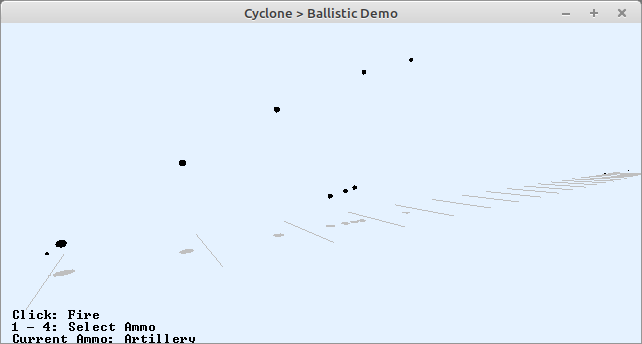

# Demo ballistic

The most simple demo is the ballistic, in the book it is already labeled as physics engine and shown on page 63.

Usage:
- Click with left mouse to create a "particle"
- keys 1-4: select different kind of particles

