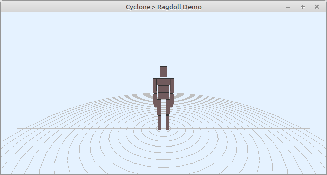

# Demo ragdoll

Usage of the rigidbody physics engine to simulate a ragdoll.

>
> !! Attention this is a work in progress, not yet working !
>

 Usage:
- Space: simulate 1 step
- P: toggle pause
- R: reset everything
- c: toggle debugdisplay

