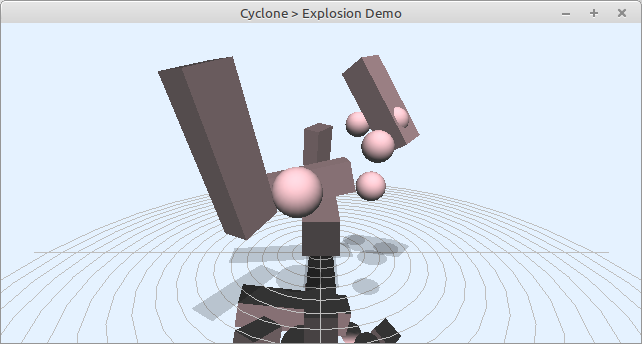

# Demo explosion

Usage of the rigidbody physics engine to simulate a simple scene.

 Usage:
- Space: simulate 1 step
- P: toggle pause
- R: reset everything
- C: toggle debugdisplay
- T: toggle vertical mouse control of box 1
- E: toggle horizontal mouse control ob box 1
- F: accelerate Ball 1 to centre

